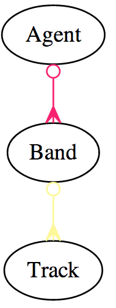

#Draft: Do Not Use!
---------
Intro to Model Associations
==================


[_Relationships_](http://clients.stujophoto.com/)


#Objectives
* Explain how associations relate to real world examples
* Recognize an ERD Diagram
* Understand these model associations
	* belongs_to
	* has_many
	* has_many, through: 
* Recognize these model associations
	* has_one
	* has_one   through:
	* has_and_belongs_to_many
	
#Introduction

You're back in the Music business! Following your success on your first gig, you're linked in recommendations have led you to a new job at MooSIQ!

**MooSIQ : Cows love music too**

Contgratulations!


#Entity Relationship Diagrams

* ERDs
* ER Diagrams
* Entity Relationship Diagrams

##ERD: Agents and Bands
__One to Many__

* Real World
  * One `Agent` manages many `Band`s
  * One `Band` is managed by One `Agent`

* ERD
  * `Agent` has_many `Band`
  * `Band` belongs_to `Agent`
  


##ERD: Bands and Tracks

__Another example of One to Many__

* Real World
  * One `Band` releases many `Track`s
  * One `Track` is released by One `Band`

* ERD
  * `Band` has_many `Track`
  * `Track` belongs_to `Band`





##ERD: Tracks and Albums

__Many to Many__

* Real World
  * One `Album` includes many `Track`s
  * One `Track` is released many `Albums`

* ERD
  * `Album` has_many `Track`
  * `Track` has_many `Albums`


##ERD: Bands and Albums
__Many to Many (through)__

* Real World
  * One `Album` includes many `Band`s' `Track`s
  * One `Band` has `Track`s released on many `Albums`

* ERD
  * `Album` has_many `Band` through `Track`s
  * `Band` has_many `Albums` through `Track`s

##ERD: The Full Monty


##ERD: Exercise
You are working on a side project for a local Community College.
Help design the database for student admissions. `Applicants` can apply to any number of `DegreePrograms` with an `Application`, but need to write a separate `Application` for each. Each Application are reviewed by a single `Reviewer` but each `Reviewer` can work on multiple `Applications`

Applicant
Application
DegreeProgram
Reviewer

* Spend 10 minutes drawing out your ERD
  * What are the relationships
  * What is their type belongs_to or has_many or has_many through


#Rails: Common Associations
##belongs_to

* [belongs_to](http://guides.rubyonrails.org/association_basics.html#the-belongs-to-association)

```
rails g model Track title seconds:integer released_on:date band:references
```

This model table will have a `foreign key` column of band_id

This is what the migration looks like:

`/db/migrate/20140423222715_create_tracks.rb`


```
class CreateTracks < ActiveRecord::Migration
  def change
    create_table :tracks do |t|
      t.string :title
      t.integer :seconds
      t.date :released_on
      t.references :band, index: true
      t.timestamps
    end
  end
end

```

This is that the model looks like:

`track.rb`

```
class Track < ActiveRecord::Base
  belongs_to :band
end
```

##has_many

* [has_many](http://guides.rubyonrails.org/association_basics.html#the-has-many-association)

We generated the model and the migration with the foreign key in the belongs_to example step, we can just add the has_many block to our Band class:


<pre>
 class Band < ActiveRecord::Base
   belongs_to :agent
   <b>has_many :tracks</b>
 end
</pre>

This works because ActiveRecord knows to look for the column `band_id` in the `tracks` table
 
##has_many through:

* [has_many through:](http://guides.rubyonrails.org/association_basics.html#the-has-many-through-association)

#Less Common Associations

##has_one

* [has_one](http://guides.rubyonrails.org/association_basics.html#the-has-one-association)


##has_one through:

* [has_one through:](http://guides.rubyonrails.org/association_basics.html#the-has-one-through-association)


##has_and_belongs_to_many

* [has_and_belongs_to_many](http://guides.rubyonrails.org/association_basics.html#has-and-belongs-to-many-association-reference)


#Related Notes

* [Model field data types](http://api.rubyonrails.org/classes/ActiveRecord/ConnectionAdapters/TableDefinition.html#method-i-column

#Review

#Furter Reading


# Exercise Time

